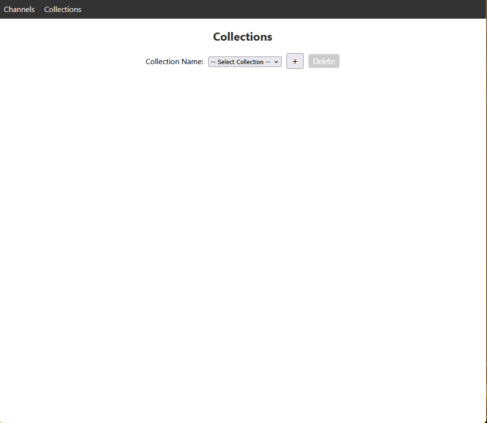

# Support Channel Admin
Support Channel Admin is used to administer your Support Channels and Support Channel Knowledge Bases

## Getting Started

- Running instances of [Support Channel KB](https://github.com/smartguy05/support_channel_kb) and [Support Channel API](https://github.com/smartguy05/support_channel_api)
- create .env file in root
```
PORT=3005
REACT_APP_SUPPORT_CHANNEL_API_URL=http://support_channel_api_ip:support_channel_api_port
REACT_APP_SUPPORT_CHANNEL_KB_URL=http://support_channel_kb_ip:support_channel_kb_port
```
- start app `npm start`


## Screenshots
### Channels
**Channels** are where you can ask questions that are answered by the data you uploaded into your collection(s)

Channel Settings


Add Channel


Edit Channel


Test your support channel


### Collections
**Collections** are groups of documents (future plan to add images) that are available to be used as context for your Support Channels 

Collection Settings


Collections Details

The details are shown for the selected collection. The API key is used by the Support Channel to secure the connection.
The list of documents is displayed below the api key in a scrolling list. If you click "delete" the file along with any
embeddings will be deleted from the database and will no longer be available for context. Below that is the fil upload 
area. Clicking in this area will open a multiple file upload dialog with a limit of 20 files or you can drag and drop
file(s) into the area outlined by dashes. A success or error message will be displayed after upload has completed.


## Available Scripts

In the project directory, you can run:

### `npm start`

Runs the app in the development mode.\
Open [http://localhost:3000](http://localhost:3000) to view it in the browser.

The page will reload if you make edits.\
You will also see any lint errors in the console.

### `npm test`

Launches the test runner in the interactive watch mode.\
See the section about [running tests](https://facebook.github.io/create-react-app/docs/running-tests) for more information.

### `npm run build`

Builds the app for production to the `build` folder.\
It correctly bundles React in production mode and optimizes the build for the best performance.

The build is minified and the filenames include the hashes.\
Your app is ready to be deployed!

See the section about [deployment](https://facebook.github.io/create-react-app/docs/deployment) for more information.

### `npm run eject`

**Note: this is a one-way operation. Once you `eject`, you can’t go back!**

If you aren’t satisfied with the build tool and configuration choices, you can `eject` at any time. This command will remove the single build dependency from your project.

Instead, it will copy all the configuration files and the transitive dependencies (webpack, Babel, ESLint, etc) right into your project so you have full control over them. All of the commands except `eject` will still work, but they will point to the copied scripts so you can tweak them. At this point you’re on your own.

You don’t have to ever use `eject`. The curated feature set is suitable for small and middle deployments, and you shouldn’t feel obligated to use this feature. However we understand that this tool wouldn’t be useful if you couldn’t customize it when you are ready for it.

## Learn More

You can learn more in the [Create React App documentation](https://facebook.github.io/create-react-app/docs/getting-started).

To learn React, check out the [React documentation](https://reactjs.org/).
